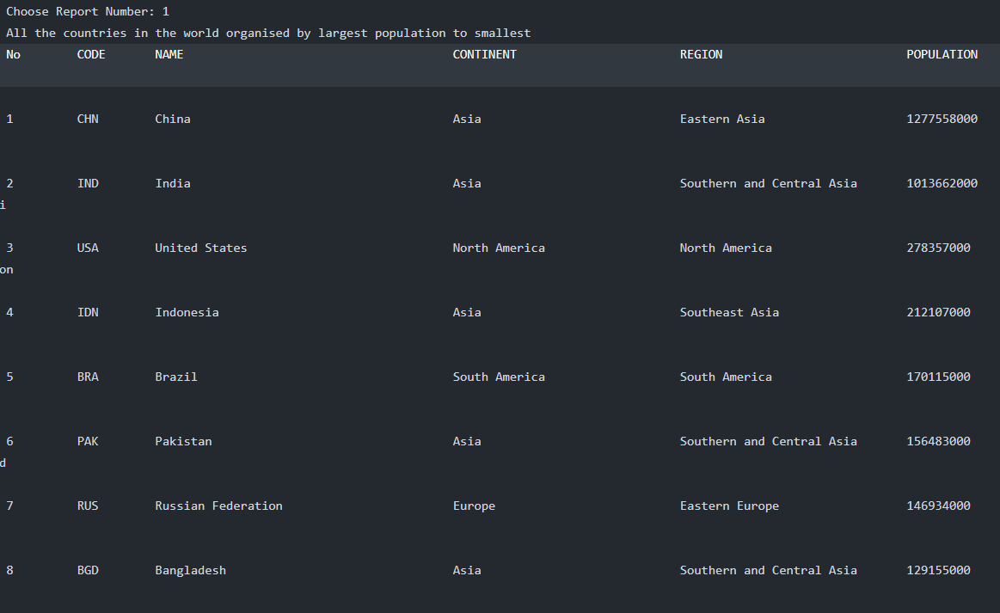
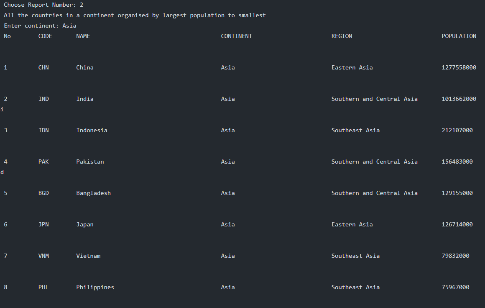
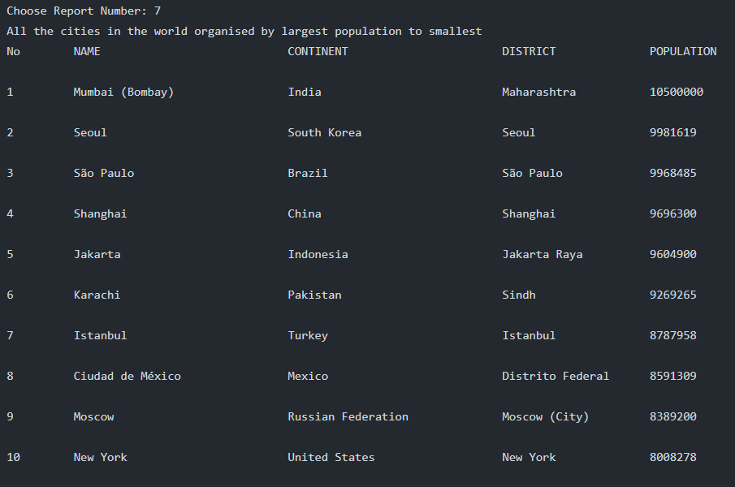
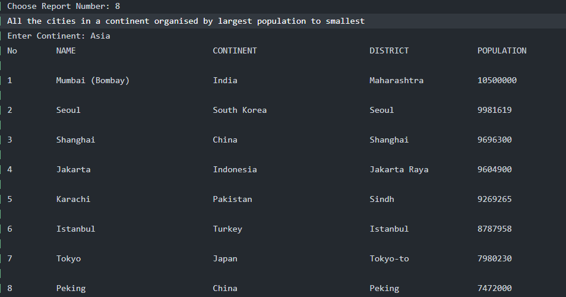
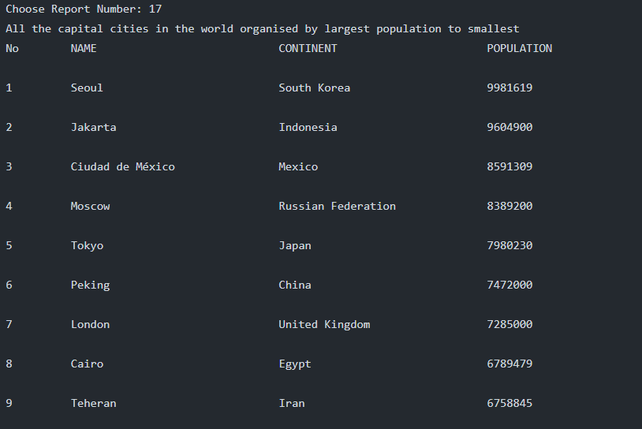
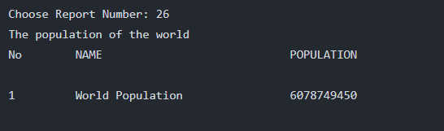
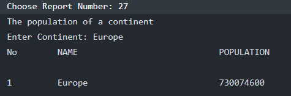
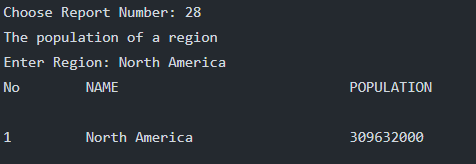
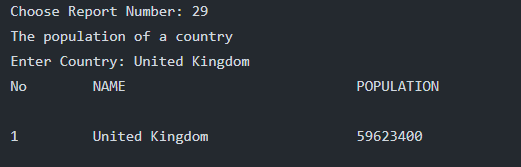
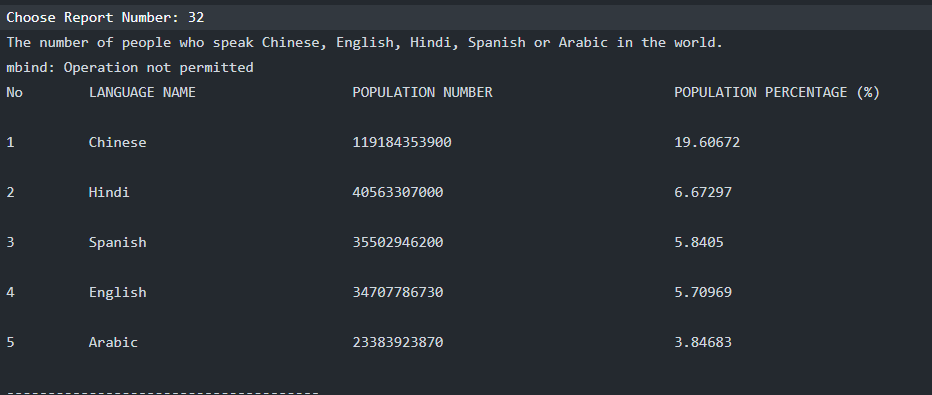

<h1>SET09623 2021-2 TR2 001 - DevOps (GROUP-4)</h1> 

# Team roles

| Role       | Member Name    | Matric No |
|------------------|----------------|----------------------|
| Product Owner    | Sai Wanna Aung | 40501792             |
| Scurm Master     | Aung Khant Min | 40501795             |
| Technical Leader | Kyaw Hein      | 40501802             |

# Team assessment point
| Member Name    |Matric No      | Code Review 1 | Code Review 2 | Code Review 3 | Code Review 4 | Final Deliverable |
|----------------|------|---------------|---------------|---------------|---------------|-------------------|
| Sai Wanna Aung |40501792   | 34            | 33            |  |  |  |
| Aung Khant Min |40501795    | 33            | 34            |  |  |  |
| Kyaw Hein      |40501802   | 33            | 33            |  |  |  |
| Total          |           | 100           | 100           |  |  |  |

# Badges
Master Build Status 

Develop Build Status 

License 

Release 

Code of Conduct 

# Report for Sprint-2
| No  | Issues ID | Name                                                                             | Requirement Meet | Screenshot             |
|-----|-----------|----------------------------------------------------------------------------------|------------------|------------------------|
| 1   | 1         | All the countries in the world organised by largest population to smallest.      | Yes              |   |
| 2   | 2         | All the countries in a continent organised by largest population to smallest.    | Yes              |   |
| 3   | 7         | All the cities in the world organised by largest population to smallest.         | Yes              |   |
| 4   | 8         | All the cities in a continent organised by largest population to smallest.       | Yes              |   |
| 5   | 17        | All the capital cities in the world organised by largest population to smallest. | Yes              |  |
| 6   | 26        | The population of the world.                                                     | Yes              |  |
| 7   | 27        | The population of a continent.                                                   | Yes              |  |
| 8   | 28        | The population of a region.                                                      | Yes              |  |
| 9   | 29        | The population of a country.                                                     | Yes              |  |
| 10  | 32        | The number of people who speak the Chinese,English,Hindi,Spanish,Arabic languages from greatest number to smallest, including the percentage of the world population.                                                                                | Yes              |  |