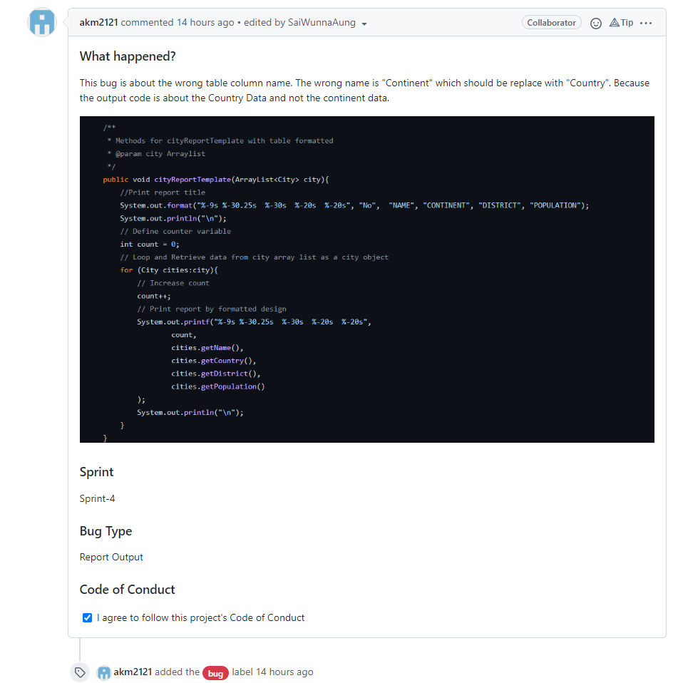
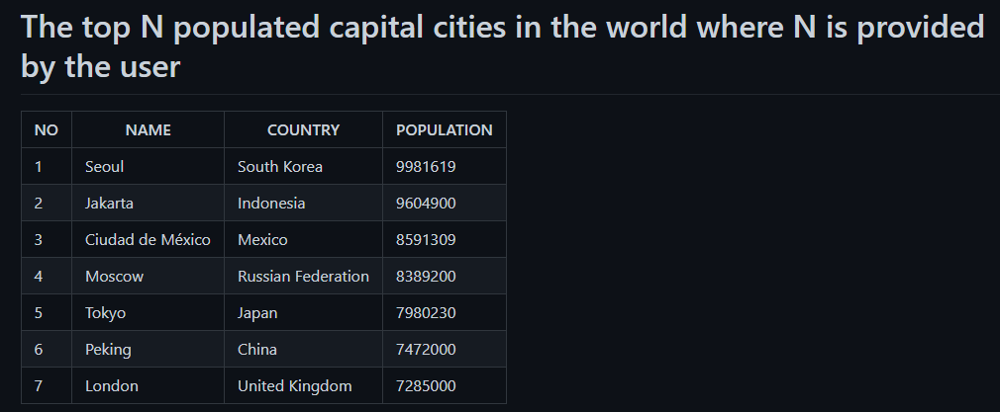

<h1>SET09623 2021-2 TR2 001 - DevOps (GROUP-4)</h1> 

# Team roles

| Role       | Member Name    | Matric No |
|------------------|----------------|----------------------|
| Product Owner    | Sai Wanna Aung | 40501792             |
| Scurm Master     | Aung Khant Min | 40501795             |
| Technical Leader | Kyaw Hein      | 40501802             |

# Team assessment point
| Member Name    |Matric No      | Code Review 1 | Code Review 2 | Code Review 3 | Code Review 4 | Final Deliverable |
|----------------|------|---------------|---------------|---------------|---------------|-------------------|
| Sai Wanna Aung |40501792   | 34            | 33            | 33            | 34            |  |
| Aung Khant Min |40501795    | 33            | 34            | 33            | 33            |  |
| Kyaw Hein      |40501802   | 33            | 33            | 34            | 33            |  |
| Total          |           | 100           | 100           | 100              | 100           |  |

# Badges
Master Build Status 

Develop Build Status 

License 

Release 

Code of Conduct 

Code Coverage 

<a href="ttps://devopsgroup4.azurewebsites.net" target="_blank">WebLink</a>
# Bug Reporting System 

# 32 requirements of 32 have been implemented, which is 100%.
| ID | Name                                                                                                                                                                  | Met | Screenshot                                 |
| --- |-----------------------------------------------------------------------------------------------------------------------------------------------------------------------| --- |--------------------------------------------|
| 1 | All the countries in the world organised by largest population to smallest.                                                                                           | Yes |        |
| 2 | All the countries in a continent organised by largest population to smallest.                                                                                         | Yes |        |
| 3 | All the countries in a region organised by largest population to smallest.                                                                                            | Yes |      |
| 4 | The top N populated countries in the world where N is provided by the user.                                                                                           | Yes |       |
| 5 | The top N populated countries in a continent where N is provided by the user.                                                                                         | Yes |       |
| 6 | The top N populated countries in a region where N is provided by the user.                                                                                            | Yes |        |
| 7 | All the cities in the world organised by largest population to smallest.                                                                                              | Yes |           |
| 8 | All the cities in a continent organised by largest population to smallest.                                                                                            | Yes |           |
| 9 | All the cities in a region organised by largest population to smallest.                                                                                               | Yes |         |
| 10 | All the cities in a country organised by largest population to smallest.                                                                                              | Yes |          |
| 11 | All the cities in a district organised by largest population to smallest.                                                                                             | Yes |          |
| 12 | The top N populated cities in the world where N is provided by the user.                                                                                              | Yes |           |
| 13 | The top N populated cities in a continent where N is provided by the user.                                                                                            | Yes |         |
| 14 | The top N populated cities in a region where N is provided by the user.                                                                                               | Yes |         |
| 15 | The top N populated cities in a country where N is provided by the user.                                                                                              | Yes |         |
| 16 | The top N populated cities in a district where N is provided by the user.                                                                                             | Yes |           |
| 17 | All the capital cities in the world organised by largest population to smallest.                                                                                      | Yes |    |
| 18 | All the capital cities in a continent organised by largest population to smallest.                                                                                    | Yes |    |
| 19 | All the capital cities in a region organised by largest to smallest.                                                                                                  | Yes |  |
| 20 | The top N populated capital cities in the world where N is provided by the user.                                                                                      | Yes |   |
| 21 | The top N populated capital cities in a continent where N is provided by the user.                                                                                    | Yes |   |
| 22 | The top N populated capital cities in a region where N is provided by the user.                                                                                       | Yes |    |
| 23 | The population of people, people living in cities, and people not living in cities in each continent.                                                                 | Yes |     |
| 24 | The population of people, people living in cities, and people not living in cities in each region.                                                                    | Yes |     |
| 25 | The population of people, people living in cities, and people not living in cities in each country.                                                                   | Yes |   |
| 26 | The population of the world.                                                                                                                                          | Yes |     |
| 27 | The population of a continent.                                                                                                                                        | Yes |     |
| 28 | The population of a region.                                                                                                                                           | Yes |   |
| 29 | The population of a country.                                                                                                                                          | Yes |    |
| 30 | The population of a district.                                                                                                                                         | Yes |    |
| 31 | The population of a city.                                                                                                                                             | Yes |     |
| 32 | The number of people who speak the Chinese,English,Hindi,Spanish,Arabic languages from greatest number to smallest, including the percentage of the world population. | Yes |   |

